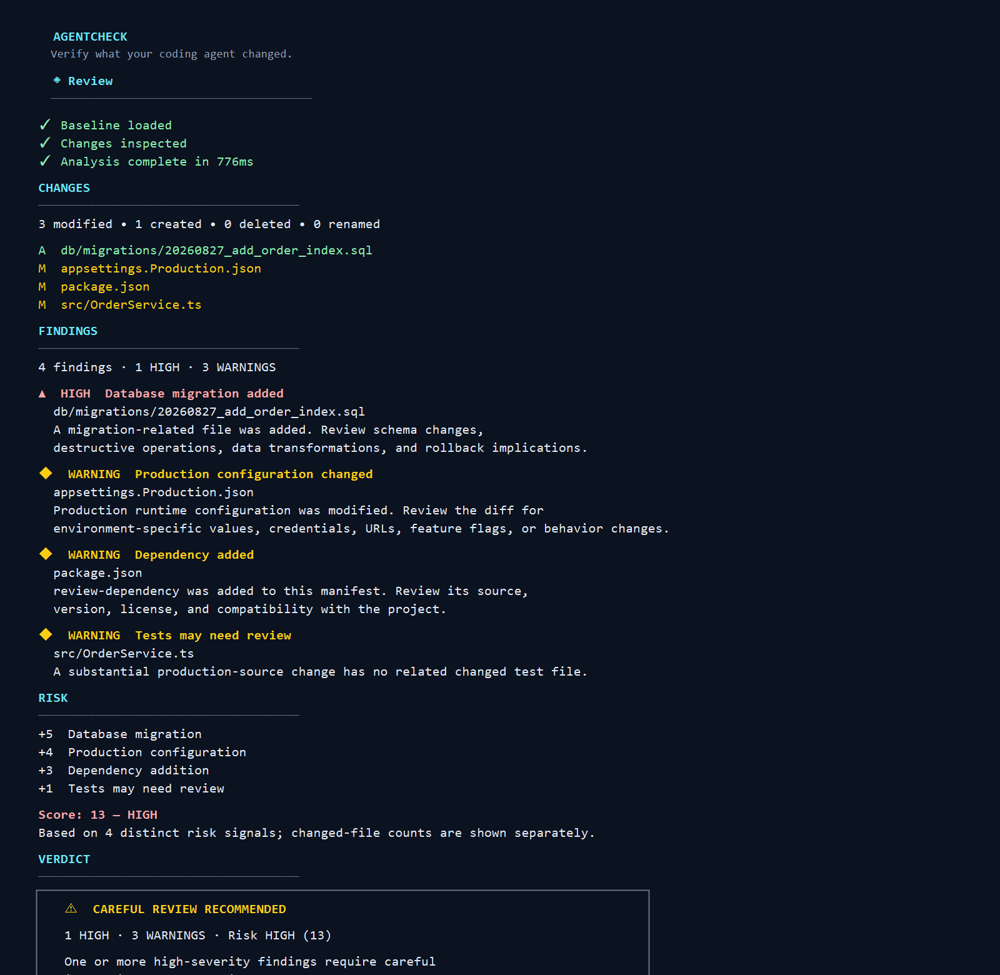

# AgentCheck

> Your coding agent says it's done. AgentCheck tells you what changed and what deserves your attention before you commit.

Deterministic, local-first verification of coding-agent changes before you commit.

Create a checkpoint with `agentcheck start`, let your coding agent work, then run `agentcheck` to review the change set locally before committing.



Available as the [`@agentcheck/cli` npm package](https://www.npmjs.com/package/@agentcheck/cli), the [`@agentcheck/core` npm package](https://www.npmjs.com/package/@agentcheck/core), and the [AgentCheck extension on the Visual Studio Marketplace](https://marketplace.visualstudio.com/items?itemName=agentcheck.agentcheck-vscode).

AgentCheck standardizes the manual review loop that usually follows an agent's “done” message:

```text
coding agent → "done" → git status/diff, dependencies, migrations,
configuration, tests and secrets → developer review → commit
```

It creates a Git-backed checkpoint, compares that checkpoint with the current repository state, and reports deterministic findings, a transparent risk score, and a restrained verdict.

## v0.1.3 highlights

- A polished interactive CLI with semantic color, TTY-only progress, elapsed timing, and deterministic non-TTY output.
- Migration-oriented SQL filenames are detected outside conventional migration directories without classifying ordinary SQL files as migrations.
- Ignored `.env` and `.env.*` files participate in review snapshots through AgentCheck's temporary index; other ignored files remain excluded.

## How it works

```text
agentcheck start → coding agent → agentcheck → review → commit
```

AgentCheck preserves the real Git index. Each checkpoint baseline represents `HEAD` plus the Git-visible working-tree state at that moment: pre-existing staged and unstaged tracked changes, tracked deletions, and non-ignored untracked files, with a narrow ignored `.env`/`.env.*` exception. See [SEMANTICS.md](SEMANTICS.md) for the exact model.

## Installation

AgentCheck requires Node.js 22 or newer. Install the command-line product globally:

```bash
npm install -g @agentcheck/cli
```

The npm package is named `@agentcheck/cli`; the executable it installs is intentionally named `agentcheck`.

## CLI usage

```bash
agentcheck start

# run your coding agent

# review changes since the checkpoint
agentcheck

agentcheck clear
```

`agentcheck check` is an explicit alias for the argumentless review command.

### Scriptable JSON review

For local scripts and tools, use the narrow machine-readable form:

```bash
agentcheck check --format json
```

On a successful review, stdout contains exactly one pretty-printed, schema-versioned Core `ReviewReport` JSON document. Operational errors write a concise diagnostic to stderr, emit no partial report, and return a non-zero exit code. A completed review always exits `0`, including when its reported risk is high; the JSON report is review data rather than a CI gate.

```json
{ "schemaVersion": 1, "changes": { "files": [] }, "findings": [], "risk": { "score": 0, "level": "low", "contributions": [] }, "verdict": "LOOKS ROUTINE" }
```

The interactive report uses terminal-aware wrapping, compact findings, severity summaries, and an actionable verdict. `NO_COLOR` keeps the same textual information; redirected output remains plain and deterministic.

### Finding message guidelines

Analyzer messages distinguish observed facts from review guidance:

- **Title:** a short, specific noun/action phrase, such as `Database migration added`.
- **Description:** why the deterministic signal may matter.
- **Evidence:** only facts AgentCheck observed, such as a change type, manifest section, or detected signal; it does not contain interpretation or secret values.
- **Action:** the concise, deterministic next inspection step authored by the Core rule; it is separate from the observed rationale and never contains secret values.

Messages use neutral language such as “may change” when AgentCheck cannot determine the semantic impact.

## What it checks

The v0.1 analyzers flag migration-related files; recognized configuration files; Git ignore, Git attributes, and selected CI/CD files; literal dependency additions, removals, and updates in supported manifests plus generic changes to selected other dependency manifests; unusually large change sets or added files; newly introduced high-confidence secret indicators; and substantial production-source changes without related changed tests. Findings are evidence-based; they do not claim that a migration will run, a dependency is safe, a secret is valid, or test coverage is absent.

## VS Code

Install AgentCheck directly from the [Visual Studio Marketplace](https://marketplace.visualstudio.com/items?itemName=agentcheck.agentcheck-vscode). The extension ID is `agentcheck.agentcheck-vscode`.

The thin extension uses the same `@agentcheck/core` workflow as the CLI. Its command palette provides Create Checkpoint, Review Changes, Show Findings, and Clear Checkpoint. The AgentCheck activity view shows changes, findings with rationale, review actions, evidence, risk, and verdict. Selecting a changed or flagged file opens VS Code's native diff between the AgentCheck checkpoint and the exact current snapshot used for the review; the checkpoint may include pre-existing dirty state and is not Git `HEAD`. The status bar shows an active checkpoint before review and the latest risk level afterward. Analysis is command-driven; the extension performs no startup scan or background monitoring.

## Core library

`@agentcheck/core` is the programmatic engine behind the CLI and VS Code extension:

```bash
npm install @agentcheck/core
```

Most command-line users should install `@agentcheck/cli` instead. See the [`@agentcheck/core` package documentation](packages/core/README.md) for its exported API.

## Privacy

Analysis is performed locally. AgentCheck itself does not upload repository or source data.

AgentCheck v0.1 has no backend, account, login, cloud upload, LLM/API call, or telemetry. It invokes the local Git executable and stores checkpoint metadata in Git's repository metadata area.

## Limitations

- Ignored untracked files are not analyzed.
- Rename detection depends on Git's rename detection.
- Secret detection is a deliberately conservative heuristic and can miss unknown credential formats or report false positives. Secret values are not included in findings.
- Line comparison is not a semantic diff.
- Related-test analysis relies on naming and path heuristics. “No related tests changed” does not mean “there are no tests,” and test attention is not a coverage claim.
- Submodule contents are not analyzed recursively.
- Multi-root VS Code workspaces are not supported in v0.1.
- AgentCheck does not guarantee correctness or security; its output is input to developer review.

## Development

```bash
npm install
npm run typecheck
npm run build
npm test
```

The monorepo contains `packages/core` for all business logic, `packages/cli` for terminal presentation, and `packages/vscode` for the thin editor UI. See [CONTRIBUTING.md](CONTRIBUTING.md) before changing analyzers.

### Release integrity

Before a local release handoff, run:

```bash
npm run verify:release
```

This deterministic, no-network check first clears generated package output and rebuilds all workspaces. In isolated temporary directories it then packs Core and CLI, verifies their published files, imports the packed Core package, installs the packed CLI with its packed Core dependency, and runs `agentcheck --version`. It also creates a temporary VSIX and checks its manifest, extension entrypoint, commands, icons, documentation, license, and excluded dependency/source boundaries. It does not publish, tag, alter package versions, modify the lockfile, or retain release artifacts.

Package versions intentionally remain independent. The check validates only real relationships: each workspace package agrees with the lockfile, and the CLI's runtime `@agentcheck/core` dependency agrees with the Core package version.

## License

Apache License 2.0. See [LICENSE](LICENSE).
